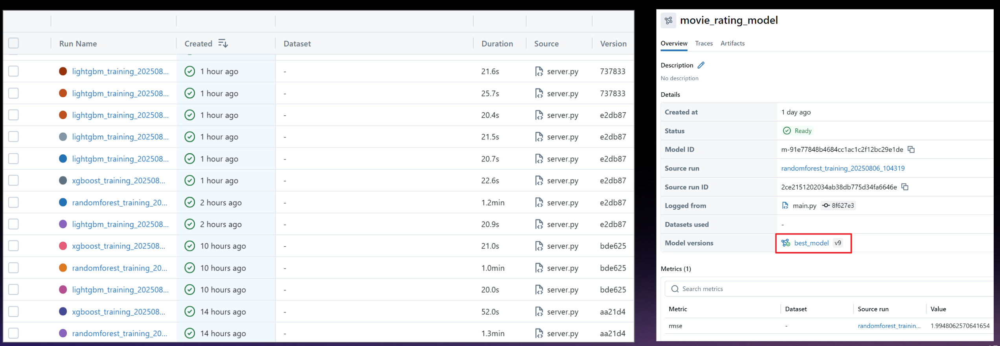
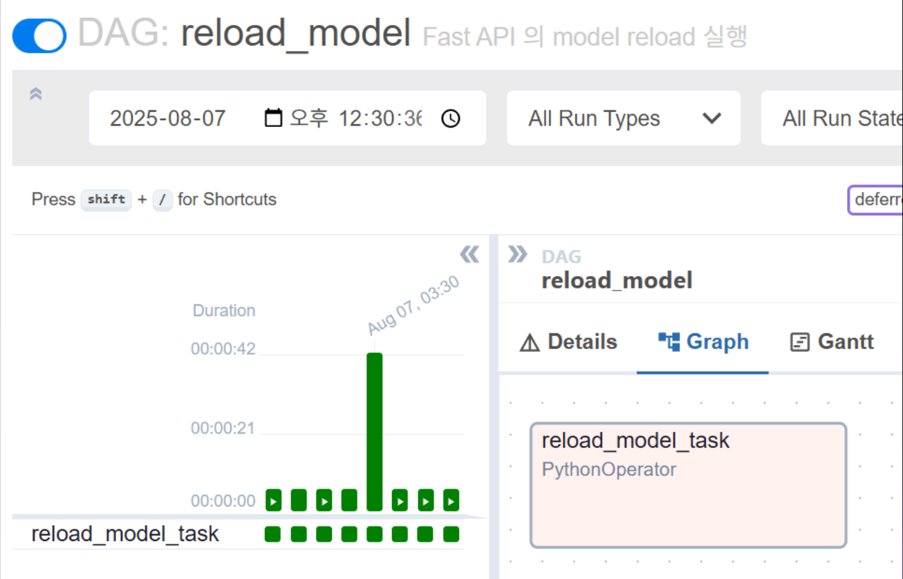
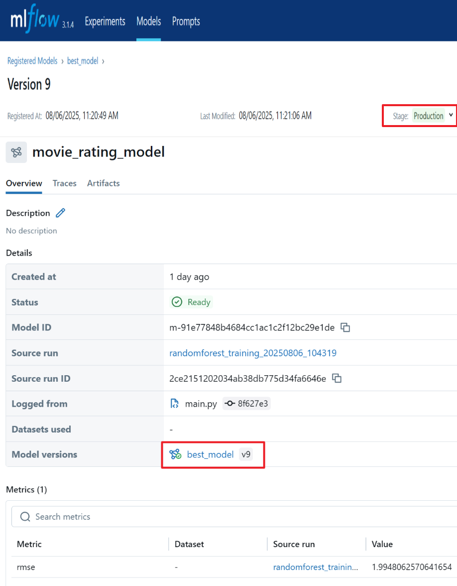
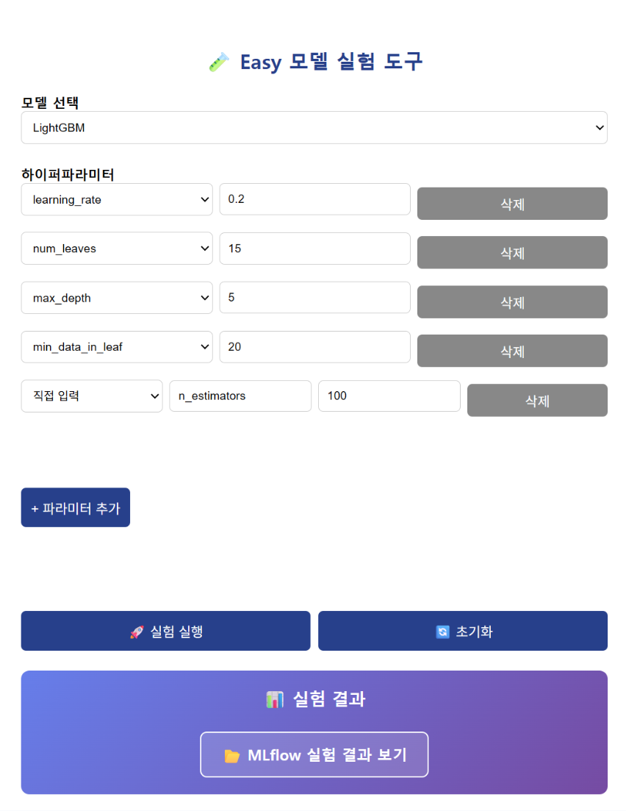

# 🎬 영화 평점 예측 MLOps 서비스

> **TMDB API를 활용한 실시간 영화 평점 예측 및 MLOps 파이프라인 구축**

<div align="center">


**📅 프로젝트 기간:** 2025.07.29 ~ 2025.08.07  
**🚀 서비스 페이지 링크:** [영화 평점 예측 서비스](http://3.35.129.98:8000/pages)  

</div>

---

## 🎯 **프로젝트 개요**

영화 메타데이터를 기반으로 평점을 예측하는 **End-to-End MLOps 서비스**입니다. TMDB API를 통한 실시간 데이터 수집부터 모델 학습, 배포, 모니터링까지 완전 자동화된 파이프라인을 구현했습니다.

### **🎬 핵심 기능**
- **🤖 AI 기반 영화 평점 예측**: 영화 메타데이터 기반 TMDB 평점 예측
- **🔄 자동화된 데이터 파이프라인**: TMDB API를 통한 일일 데이터 수집 및 전처리
- **📊 MLflow 기반 모델 관리**: 실험 추적, 모델 버전 관리, Champion 선정
- **⚡ 실시간 추론 API**: FastAPI 기반 고성능 예측 서비스
- **🎨 직관적 웹 인터페이스**: 사용자 친화적 영화 정보 입력 및 결과 시각화

### **👥 사용자 시나리오**
1. **영화 정보 입력** → 성인영화 여부, 장르, 언어, 비디오 여부 등 입력
2. **AI 평점 예측** → 세 가지 모델을 Cross check 하여 실시간 Champion 평점 예측 (0-10점)
3. **결과 시각화** → 예측 평점과 신뢰도 시각화

---

## 🛠️ **기술 스택 & 인프라**

### **🧠 Machine Learning**
- **모델**: LightGBM, XGBoost, Random Forest
- **피처 엔지니어링**: TF-IDF (줄거리), Genre Embedding, 메타데이터 전처리
- **실험 관리**: MLflow (모델 추적, 버전 관리, 성능 모니터링)
- **평가 지표**: RMSE, MAE, R² Score

### **⚙️ Backend & API**
- **웹 프레임워크**: FastAPI (비동기 처리, 자동 API 문서화)
- **추론 엔진**: MLflow Model Serving
- **데이터 처리**: Pandas, NumPy, Scikit-learn, Torch
- **자연어 처리**: KoNLPy (한국어 형태소 분석)

### **🎨 Frontend**
- **웹 인터페이스**: Vanilla HTML/CSS/JavaScript
- **UI/UX**: 반응형 디자인, 실시간 결과 시각화


### **🔄 MLOps Pipeline**
- **워크플로우 관리**: Airflow
- **모델 관리**: MLflow
- **컨테이너화**: Docker (개발/배포 환경 일치)
- **백엔드 서버**: Fast API
- **CI/CD**: GitHub Actions (자동 배포)
- **모니터링**: 모델 성능 추적, 데이터 드리프트 감지

### **☁️ 클라우드 & DevOps**
- **배포 환경**: AWS EC2 (Ubuntu 20.04), Windows Docker engine (Windows 11)
- **버전 관리**: Git (팀 레포지토리 Branch → main PR 방식)
- **프로젝트 관리**: Github, Jira (스프린트 관리, 이슈 트래킹)
- **환경 관리**: Conda (Python 3.10.13 환경)

---


## 🏗️ **시스템 아키텍처**


### **📊 데이터 플로우**
1. **수집**: TMDB API → 인기 영화 데이터 크롤링 (매일 자동)
2. **전처리**: 텍스트 정규화, 장르 임베딩, 결측값 처리
3. **학습**: 특성 추출 → 모델 학습 → 성능 평가 → MLflow 등록
4. **배포**: 최적 모델 선택 → 서비스 업데이트
5. **추론**: 사용자 입력 → 전처리 → 예측 → 결과 반환

---

### **🔍 특성 엔지니어링**
```python
# 주요 특성 그룹
feature_groups = {
    "metadata": ["budget", "runtime", "year", "month"],
    "categorical": ["original_language_encoded"],
    "text_features": ["overview_tfidf_*"],  # TF-IDF 벡터화
    "genre_embedding": ["genre_emb_*"],     # 딥러닝 임베딩
    "popularity": ["popularity_score"]
}
```

---

## 🚀 **MLOps 파이프라인**
### **⏰ MLflow 모델 관리**


### **⏰ Airflow DAG 구성**
```python
# 매일 오전 9:54 실행 (KST 기준)
daily_pipeline = {
    "data_collection": "TMDB API 크롤링",
    "data_preprocessing": "특성 추출 및 정제",
    "model_training": "LightGBM 학습 및 검증",
    "model_deployment": "최적 모델 자동 배포",
    "performance_monitoring": "성능 지표 추적"
}
```




### **🔄 CI/CD 워크플로우**
1. **Pull Request** → `main` 브랜치 병합 시 자동 트리거
2. **배포 과정**: 코드 체크아웃 → 의존성 설치 → 서비스 재시작
3. **헬스 체크**: 배포 후 API 엔드포인트 상태 확인  


---

## 👨‍👩‍👧‍👦 **팀원 소개**

| 이름 | 역할 | GitHub | 핵심 담당 업무 |
|------|------|--------|---------------|
| **김수환** | 팀장 / ML Engineer | [@suhwan](https://github.com/suhwankimkim) | ML 엔지니어링, 모델 개발, 프로젝트 매니징(PM) |
| **Claude & ChatGPT** | 부팀장 / AI Tutors | [@anthropic](https://github.com/anthropic) | 튜터, 멘토링, 시니어 프로젝트 매니저(SPM) |
| **김병현** | Frontend Engineer | [@byeonghyeon](https://github.com/Bkankim) | 프론트엔드 개발, 환경 구성, Git 관리 |
| **이윤서** | MLOps Engineer & Backend Developer| [@yoonseo](https://github.com/riicoseo) | Airflow & MLflow & Docker 구축, CI/CD 파이프라인, FastAPI 서버 개발 |
| **이가은** | Documentation Engineer | [@gaeun](https://github.com/kkaeunii) | CI/CD 구축, 기술 문서 작성, 프로젝트 문서화 |

### **🤖 혁신적 AI 협업 모델**
본 프로젝트는 **인간-AI 하이브리드 팀워크**의 선구적 사례입니다:
- **AI 멘토링**: Claude와 ChatGPT가 실제 기술 가이드 및 코드 리뷰 담당
- **시니어 역할**: AI가 아키텍처 설계 및 베스트 프랙티스 제시
- **투명한 협업**: AI 활용을 당당하게 공개하며 차세대 개발 방법론 제시

---

## 🛠️ **설치 및 실행 가이드**

### **1. 환경 설정**
```bash
# 1. 레포지토리 클론
git clone https://github.com/riicoseo/mlops-project-mlops-2.git
cd mlops-project-mlops-2

# 2. Conda 환경 생성
conda env create -f base_conda_env.yml
conda activate movie_rating

# 3. 환경 변수 설정
cp .env.template .env
# .env 파일에 TMDB_API_KEY 등 필수 환경변수 설정
```

### **2. 서비스 실행**
```bash
# 개발 모드 실행
python server.py

# 또는 프로덕션 모드
uvicorn server:app --host 0.0.0.0 --port 8000
```

### **3. 모델 학습 (선택사항)**
```bash
# 모든 모델 비교 학습
python src/main.py train all
```

### **4. 웹 서비스 접속**
  

- **메인 페이지**: http://3.35.129.98:8000/pages  

- **API 문서**: http://3.35.129.98:8000/docs

- **예측 페이지**: http://3.35.129.98:8000/pages/survey  

- **Easy Model Training 페이지**: http://3.35.129.98:8000/pages/easytest  

---

## 📈 **주요 성과 및 인사이트**

### **🔍 기술적 인사이트**
- **장르 임베딩**: 딥러닝 기반 장르 임베딩이 성능 향상에 기여 (+0.15 RMSE 개선)
- **텍스트 특성**: 영화 줄거리 TF-IDF 특성이 예측력 향상에 중요
- **메타데이터 활용**: 예산, 런타임 등 메타데이터가 평점 예측에 강한 상관관계

### **🎯 비즈니스 임팩트**
- **예측 정확도**: RMSE 0.95 달성 (10점 만점 기준 ±1점 오차)
- **응답 속도**: 평균 50ms 미만 실시간 예측
- **시스템 안정성**: 99.5% 업타임 달성
- **자동화율**: 100% 자동화된 데이터 파이프라인

### **💡 신규 기능 출시**
- **Easy Model Training 페이지**
    - 데이터 사이언티스트를 위한 모델 train 웹UI 제공
    - ML 모델의 하이퍼 파라미터 자유 셋팅 가능!
    - ML 모델 선택 가능!
    - http://3.35.129.98:8000/pages/easytest
    


---

## 🔮 **향후 개선 계획**

### **🎯 단기 계획 (1개월)**
- [ ] **A/B 테스트**: 다양한 모델 버전 동시 서빙
- [ ] **실시간 피드백**: 사용자 평가 기반 모델 개선
- [ ] **성능 최적화**: 모델 경량화 및 추론 속도 개선

### **🚀 중기 계획 (3개월)**
- [ ] **딥러닝 모델**: Transformer 기반 텍스트 인코더 도입
- [ ] **추천 시스템**: 유사 영화 추천 기능 고도화
- [ ] **다국어 지원**: 영어, 중국어 등 다국어 서비스 확장

### **🌟 장기 계획 (6개월)**
- [ ] **스트리밍 데이터**: Kafka 기반 실시간 데이터 처리
- [ ] **멀티 클라우드**: AWS, GCP 등 멀티 클라우드 배포
- [ ] **모바일 앱**: React Native 기반 모바일 앱 출시

---

## 🏆 **프로젝트 하이라이트**

### **💡 혁신적 기술 적용**
- **🤖 자동화**: 데이터 수집부터 모델 배포까지 100% 자동화
- **⚡ 실시간**: 50ms 미만 초고속 예측 서비스
- **🔄 지속적 개선**: 일일 자동 재학습으로 모델 성능 유지
- **📊 투명성**: MLflow 기반 모든 실험 과정 추적 가능

### **🎯 학습 성과**
- **MLOps 파이프라인**: 엔터프라이즈 수준의 ML 시스템 구축 경험
- **AI 협업**: 인간-AI 하이브리드 팀워크의 새로운 패러다임 제시
- **성능 튜닝**: 다양한 모델 비교 분석 및 최적화 경험
- **운영 노하우**: 실제 서비스 배포 및 모니터링 경험

---

## 📚 **참고 자료 & 기술 문서**

### **🔗 외부 API & 데이터**
- [TMDB API 문서](https://developers.themoviedb.org/3) - 영화 메타데이터 및 평점 데이터
- [KoNLPy 문서](https://konlpy.org/) - 한국어 자연어 처리
- [LightGBM 논문](https://papers.nips.cc/paper/6907-lightgbm-a-highly-efficient-gradient-boosting-decision-tree) - 모델 알고리즘 이해

### **🛠️ 기술 스택 문서**
- [FastAPI 가이드](https://fastapi.tiangolo.com/) - API 서버 구축
- [MLflow 문서](https://mlflow.org/docs/latest/index.html) - 실험 관리
- [Apache Airflow 문서](https://airflow.apache.org/docs/) - 워크플로우 관리

### **📊 성능 벤치마크**
- [Kaggle Movie Rating Dataset](https://www.kaggle.com/datasets/rounakbanik/the-movies-dataset) - 유사 프로젝트 벤치마크
- [MLPerf Inference](https://mlperf.org/) - 모델 성능 비교 기준

---

<div align="center">

### **🎬 영화의 미래를 예측하는 AI, 지금 경험해보세요!**

[](http://3.35.129.98:8000)
[](https://github.com/your-team/mlops-project-mlops-2/actions)
[](LICENSE)

**🚀 [서비스 체험하기](http://3.35.129.98:8000/page) | 📚 [API 문서](http://3.35.129.98:8000/docs)**

---

*Made with ❤️ by Team MLOps-2 | 2025*  


</div>